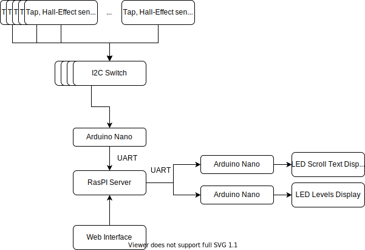

This is an repo contains the software to run a point of sale system that displays the attributes for a given beer depending on the tap that was pulled. This project was created for a brewery that needed the ability to frequently change out the set of beers. The program was designed to be embedded on a local raspberry pi that would also be used to read and drive the sensors and displays. The web server is a flask app with an SQLite database. As of this writing the configuration has been running 24 hours a day without failure except for a Hall Effect sensor and an over heating issue early on (fixed with a serious cooling solution for the pi).

The basic hardware config

The file "testprograms" contain python files to test the hardware from the Raspberry Pi.

The file "TeensyPrograms" conatin the files for the Arduino Nanos.

The file "telegramapp" contains files for a  demo to run the application via Telegram bot.

The file "App" contains the server code.
